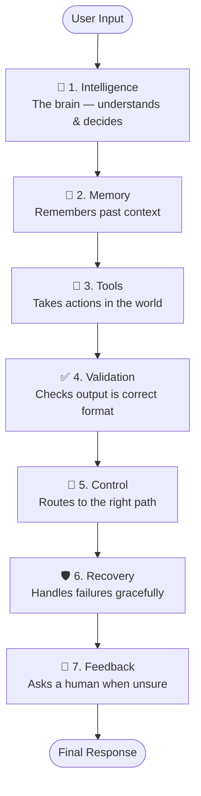
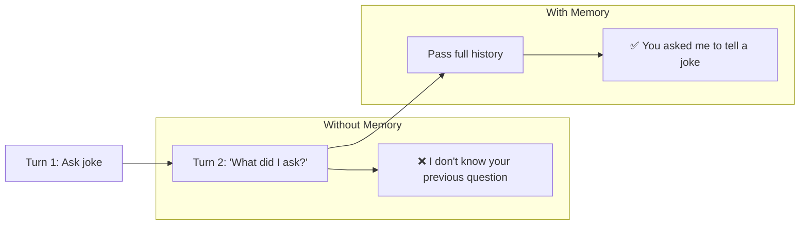
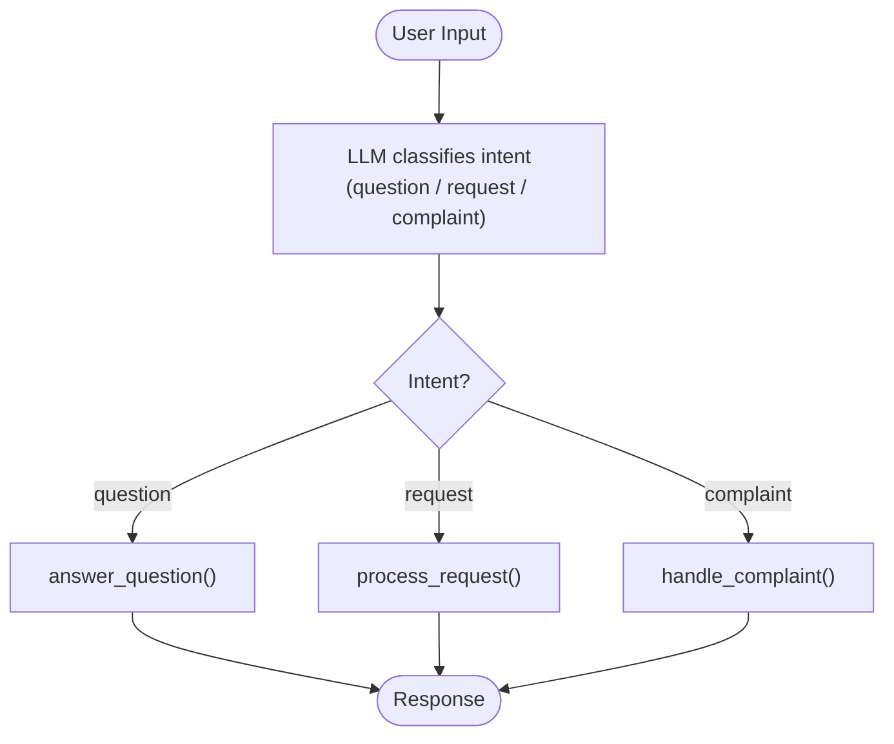
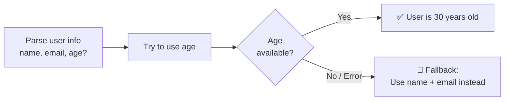
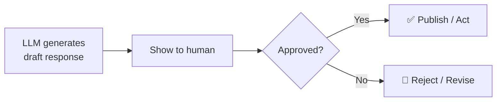
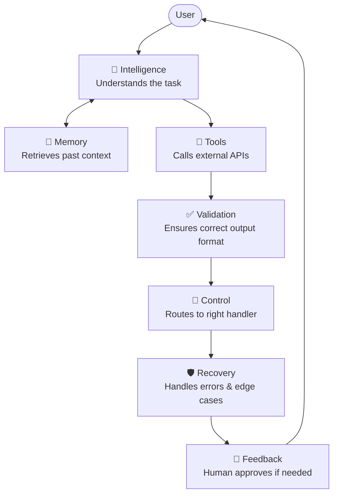

# 7 Building Blocks for Reliable AI Agents

Every reliable AI agent is made up of the same 7 building blocks. Master these and you can build any agent.

---

## How the blocks fit together



---

## The 7 Building Blocks

### 1. 🧠 Intelligence — `1-intelligence.py`

> **The brain of the agent.** Processes input, understands context, and generates a response.

```
User prompt → LLM (GPT-4o) → Text response
```

**What it does:** Sends a prompt to an LLM and gets back a text answer.  
**Key API:** `client.responses.create(model="gpt-4o", input=prompt)`

---

### 2. 💾 Memory — `2-memory.py`

> **Lets the agent remember.** Stores past messages so the agent can answer follow-up questions coherently.



**What it does:** Passes the full conversation history in each API call so the agent maintains context.  
**Key pattern:** Include all previous `user` + `assistant` messages in the `input` array.

---

### 3. 🔧 Tools — `3-tools.py`

> **Gives the agent hands.** Lets it call external APIs, query databases, or run code.


**What it does:** Defines functions the LLM can call; your code executes them and returns results.  
**Key pattern:** Define tools schema → LLM calls them → your code runs them → pass result back.

---

### 4. ✅ Validation — `4-validation.py`

> **Guarantees the output shape.** Forces the LLM to return structured, typed data instead of free text.


**What it does:** Uses `client.responses.parse()` + a Pydantic model to get typed, validated output.  
**Why it matters:** Downstream code can safely access `.task`, `.completed`, `.priority` without string parsing.

---

### 5. 🔀 Control — `5-control.py`

> **The traffic director.** Uses if/then logic to route to the right handler based on what the user wants.



**What it does:** Classifies intent with a structured LLM call, then routes to specialised handlers.  
**Why it matters:** Keeps each handler focused and avoids one giant prompt trying to do everything.

---

### 6. 🛡️ Recovery — `6-recovery.py`

> **The safety net.** Handles missing data, API errors, and unexpected output without crashing.



**What it does:** Wraps risky operations in `try/except` and provides fallback behaviour.  
**Why it matters:** Agents operate in the real world — data is messy, APIs fail, fields go missing.

---

### 7. 👤 Feedback — `7-feedback.py`

> **Keeps a human in the loop.** Pauses and asks for approval before committing high-stakes actions.



**What it does:** After generating output, shows it to a human and waits for `y/n` approval.  
**Why it matters:** For high-risk actions (sending emails, making payments, publishing content), human sign-off prevents costly mistakes.

---

## All 7 blocks working together



---

## Quick Reference

| # | Block | File | One-liner |
|---|-------|------|-----------|
| 1 | 🧠 Intelligence | `1-intelligence.py` | LLM processes input and generates a response |
| 2 | 💾 Memory | `2-memory.py` | Pass full chat history to maintain context |
| 3 | 🔧 Tools | `3-tools.py` | LLM calls your functions to act in the world |
| 4 | ✅ Validation | `4-validation.py` | Pydantic schema forces structured, typed output |
| 5 | 🔀 Control | `5-control.py` | If/then routing based on classified intent |
| 6 | 🛡️ Recovery | `6-recovery.py` | Try/except + fallbacks for graceful failure |
| 7 | 👤 Feedback | `7-feedback.py` | Human approval gate for high-stakes actions |

---

## Running the examples

```bash
cd agents/building-blocks

# Run each block independently
python 1-intelligence.py
python 2-memory.py
python 3-tools.py
python 4-validation.py
python 5-control.py
python 6-recovery.py
python 7-feedback.py   # will prompt for y/n approval
```

**Requires:** `OPENAI_API_KEY` set in your environment or a `.env` file in this directory.
