# Building Effective Agents

> Based on Anthropic's engineering guide: [Building effective agents](https://www.anthropic.com/engineering/building-effective-agents)  
> Originally published: Dec 19, 2024 · Authors: Erik S. & Barry Zhang

The most successful LLM agent implementations use **simple, composable patterns** rather than complex frameworks. This guide covers everything you need to build reliable, production-ready agentic systems.

---

## Table of Contents

1. [What are Agents?](#1-what-are-agents)
2. [When (and When Not) to Use Agents](#2-when-and-when-not-to-use-agents)
3. [When and How to Use Frameworks](#3-when-and-how-to-use-frameworks)
4. [Building Block: The Augmented LLM](#4-building-block-the-augmented-llm)
5. [Workflow: Prompt Chaining](#5-workflow-prompt-chaining)
6. [Workflow: Routing](#6-workflow-routing)
7. [Workflow: Parallelization](#7-workflow-parallelization)
8. [Workflow: Orchestrator-Workers](#8-workflow-orchestrator-workers)
9. [Workflow: Evaluator-Optimizer](#9-workflow-evaluator-optimizer)
10. [Autonomous Agents](#10-autonomous-agents)
11. [Combining Patterns](#11-combining-patterns)
12. [Summary & Core Principles](#12-summary--core-principles)
13. [Appendix A: Agents in Practice](#appendix-a-agents-in-practice)
14. [Appendix B: Prompt Engineering Your Tools](#appendix-b-prompt-engineering-your-tools)

---

## 1. What are Agents?

"Agent" is an overloaded term. Anthropic draws a clear architectural distinction:

| Type | Definition |
|------|-----------|
| **Workflow** | LLMs and tools orchestrated through **predefined code paths** |
| **Agent** | LLMs that **dynamically direct** their own processes and tool usage |

Both are collectively called **agentic systems**.

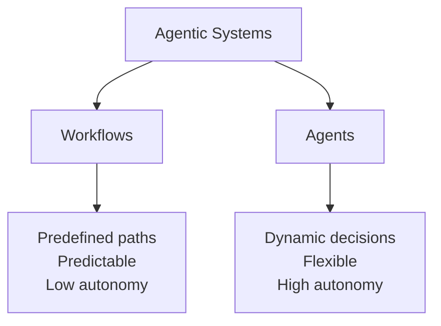

---

## 2. When (and When Not) to Use Agents

> **Principle:** Always start with the simplest solution. Add complexity only when it demonstrably improves outcomes.

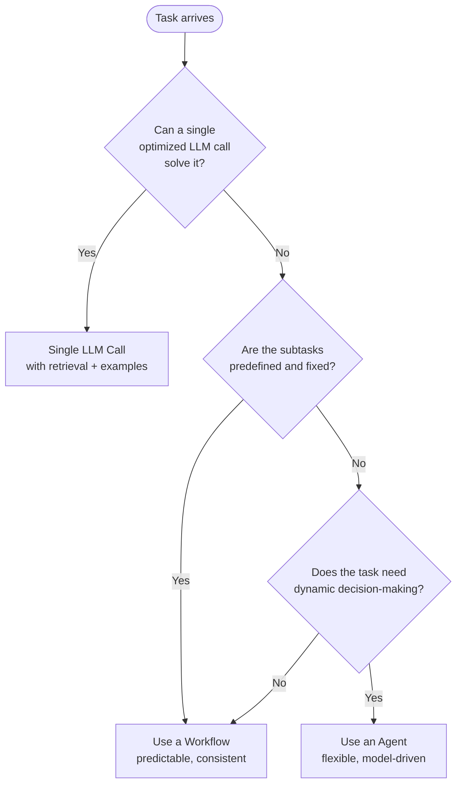

### Trade-offs

| Approach | Latency | Cost | Accuracy | Flexibility |
|----------|---------|------|----------|-------------|
| Single LLM call | ⚡ Low | 💚 Cheap | ✅ Good for simple tasks | ❌ None |
| Workflow | 🟡 Medium | 🟡 Medium | ✅ High for defined tasks | 🟡 Limited |
| Agent | 🔴 High | 🔴 High | ✅ High for complex tasks | ✅ Full |

### Practical Example — Deciding What to Build

```python
def classify_task_complexity(task: str) -> str:
    """
    Heuristic to decide which pattern to use before building.
    """
    # Single call: lookup, Q&A, summarisation, classification
    single_call_keywords = ["summarise", "classify", "translate", "explain", "what is"]

    # Workflow: multi-step but predictable
    workflow_keywords = [
        "generate then review",
        "outline then write",
        "extract then format",
    ]

    # Agent: open-ended, unpredictable steps
    agent_keywords = ["research", "debug", "autonomously", "figure out", "investigate"]

    task_lower = task.lower()

    if any(k in task_lower for k in single_call_keywords):
        return "single_llm_call"
    elif any(k in task_lower for k in workflow_keywords):
        return "workflow"
    elif any(k in task_lower for k in agent_keywords):
        return "agent"
    else:
        return "single_llm_call"  # default: start simple


print(classify_task_complexity("Summarise this document"))  # single_llm_call
print(classify_task_complexity("Research and debug this issue"))  # agent
print(classify_task_complexity("Generate then review the copy"))  # workflow
```

---

## 3. When and How to Use Frameworks

### Available Frameworks

| Framework | Type | Best for |
|-----------|------|----------|
| [Claude Agent SDK](https://platform.claude.com/docs/en/agent-sdk/overview) | Code | Production Claude agents |
| [Strands Agents SDK (AWS)](https://strandsagents.com/latest/) | Code | AWS-integrated agents |
| [Rivet](https://rivet.ironcladapp.com/) | GUI (drag & drop) | Visual workflow building |
| [Vellum](https://www.vellum.ai/) | GUI | Testing complex workflows |

### Anthropic's Recommendation

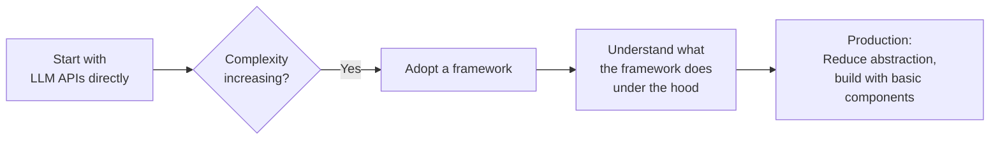

> **Rule:** Use frameworks to get started quickly. Move back to bare API calls as you approach production — abstraction layers obscure prompts and responses, making debugging harder.

### Practical Example — Direct API vs Framework

```python
# ✅ Direct API approach (recommended for production)
from anthropic import Anthropic

client = Anthropic()


def call_llm(prompt: str, system: str = "") -> str:
    response = client.messages.create(
        model="claude-sonnet-4-5",
        max_tokens=1024,
        system=system,
        messages=[{"role": "user", "content": prompt}],
    )
    return response.content[0].text


# Usage
result = call_llm(
    prompt="What is the capital of France?",
    system="You are a helpful geography assistant.",
)
print(result)
```

---

## 4. Building Block: The Augmented LLM

The foundation of every agentic system is an LLM enhanced with three capabilities:

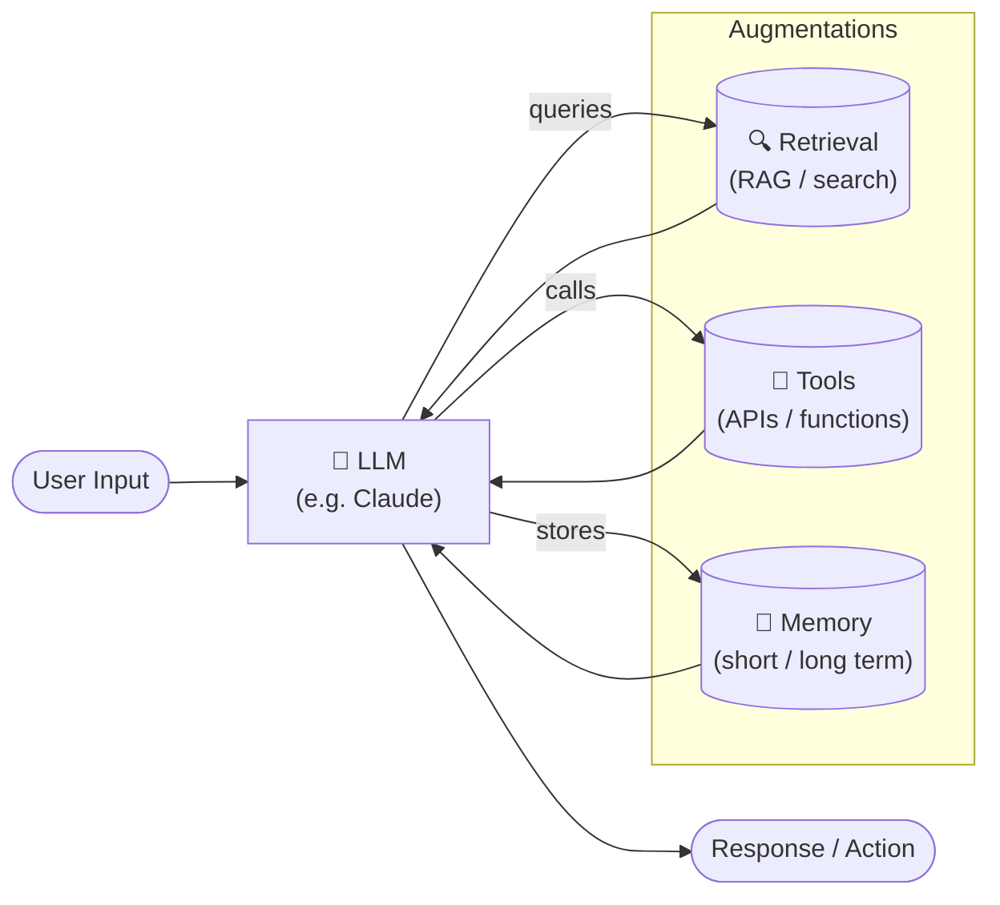

### Key Principles
- **Retrieval** — the LLM generates its own search queries
- **Tools** — the LLM selects and invokes appropriate tools
- **Memory** — the LLM decides what context to retain across steps

### Practical Example — Augmented LLM with Tool Use

```python
import anthropic
import json

client = anthropic.Anthropic()

# Define tools
tools = [
    {
        "name": "search_knowledge_base",
        "description": "Search an internal knowledge base for relevant documents.",
        "input_schema": {
            "type": "object",
            "properties": {
                "query": {"type": "string", "description": "The search query"},
                "max_results": {
                    "type": "integer",
                    "description": "Number of results to return",
                    "default": 3,
                },
            },
            "required": ["query"],
        },
    },
    {
        "name": "get_current_date",
        "description": "Returns today's date.",
        "input_schema": {"type": "object", "properties": {}},
    },
]


def search_knowledge_base(query: str, max_results: int = 3) -> list:
    """Simulated knowledge base search."""
    return [
        {"title": f"Doc about {query}", "content": f"Content relevant to {query}"}
    ] * max_results


def get_current_date() -> str:
    from datetime import date

    return str(date.today())


def run_augmented_llm(user_message: str) -> str:
    messages = [{"role": "user", "content": user_message}]

    while True:
        response = client.messages.create(
            model="claude-sonnet-4-5",
            max_tokens=1024,
            tools=tools,
            messages=messages,
        )

        if response.stop_reason == "end_turn":
            return next(b.text for b in response.content if hasattr(b, "text"))

        # Process tool calls
        tool_results = []
        for block in response.content:
            if block.type == "tool_use":
                if block.name == "search_knowledge_base":
                    result = search_knowledge_base(**block.input)
                elif block.name == "get_current_date":
                    result = get_current_date()
                else:
                    result = "Tool not found"

                tool_results.append(
                    {
                        "type": "tool_result",
                        "tool_use_id": block.id,
                        "content": json.dumps(result),
                    }
                )

        messages.append({"role": "assistant", "content": response.content})
        messages.append({"role": "user", "content": tool_results})


# Usage
answer = run_augmented_llm("What do our docs say about refund policies?")
print(answer)
```

---

## 5. Workflow: Prompt Chaining

Decomposes a task into a **fixed sequence of steps**, where each LLM call processes the output of the previous one. Gates can validate intermediate outputs.

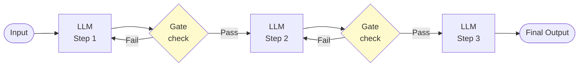

### When to Use
- Task can be decomposed into **clean, fixed subtasks**
- You want to trade **latency for accuracy**
- Each step has clear, verifiable success criteria

### Real-world Examples
- Write marketing copy → translate into French
- Generate a document outline → validate structure → write full document

### Practical Example — Blog Post Pipeline

```python
from anthropic import Anthropic

client = Anthropic()


def llm(prompt: str, system: str = "") -> str:
    r = client.messages.create(
        model="claude-sonnet-4-5",
        max_tokens=2048,
        system=system,
        messages=[{"role": "user", "content": prompt}],
    )
    return r.content[0].text


def gate_check(text: str, criteria: str) -> bool:
    """Use LLM as a gate to validate intermediate output."""
    verdict = llm(
        prompt=f"Does the following text meet this criteria?\nCriteria: {criteria}\n\nText:\n{text}\n\nRespond with only YES or NO.",
    )
    return "YES" in verdict.upper()


def blog_post_chain(topic: str) -> str:
    # Step 1: Generate outline
    outline = llm(
        system="You are an expert content strategist.",
        prompt=f"Write a detailed blog post outline about: {topic}. Include 5 main sections with sub-points.",
    )
    print("✅ Step 1: Outline generated")

    # Gate: validate outline has enough structure
    if not gate_check(outline, "Has at least 5 main sections with sub-points"):
        raise ValueError("Outline failed gate check — retrying needed")

    # Step 2: Write introduction
    intro = llm(
        system="You are an engaging technical writer.",
        prompt=f"Write a compelling introduction for a blog post based on this outline:\n\n{outline}",
    )
    print("✅ Step 2: Introduction written")

    # Step 3: Write full post
    full_post = llm(
        system="You are an expert technical blogger.",
        prompt=f"Write a complete, detailed blog post based on:\nOutline:\n{outline}\n\nIntroduction:\n{intro}\n\nExpand all sections fully.",
    )
    print("✅ Step 3: Full post written")

    return full_post


post = blog_post_chain("Building effective AI agents")
print(post[:500] + "...")
```

---

## 6. Workflow: Routing

Classifies an input and **directs it to a specialised downstream handler**. Keeps prompts focused by separating concerns.

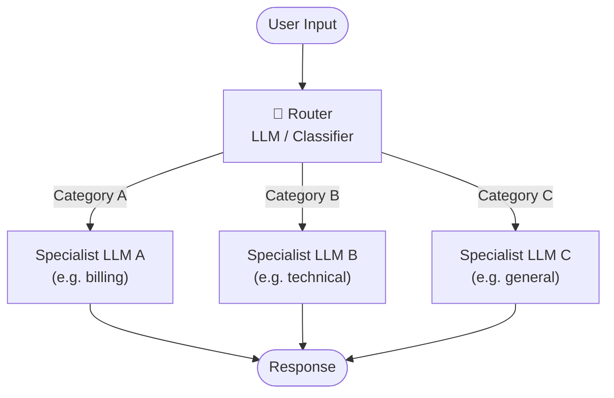

### When to Use
- Distinct input categories that benefit from **different prompts or models**
- Classification can be done **accurately** by LLM or a classifier
- Optimising for one type shouldn't hurt another

### Real-world Examples
- Customer support: billing queries → billing team prompt, tech support → tech prompt
- Cost optimisation: easy questions → Claude Haiku, hard questions → Claude Sonnet

### Practical Example — Customer Support Router

```python
from anthropic import Anthropic

client = Anthropic()


SYSTEM_PROMPTS = {
    "billing": "You are a billing support specialist. Help with invoices, payments, and subscription queries. Be precise and empathetic.",
    "technical": "You are a senior technical support engineer. Help debug issues, explain errors, and guide through technical solutions step by step.",
    "general": "You are a friendly general support agent. Answer questions clearly and escalate complex issues when needed.",
}


def route_query(query: str) -> str:
    """Use LLM to classify the query type."""
    response = client.messages.create(
        model="claude-haiku-4-5",  # cheap model for routing
        max_tokens=10,
        system="Classify the customer query into one of: billing, technical, general. Respond with only the category name.",
        messages=[{"role": "user", "content": query}],
    )
    category = response.content[0].text.strip().lower()
    return category if category in SYSTEM_PROMPTS else "general"


def handle_query(query: str) -> str:
    category = route_query(query)
    print(f"🔀 Routed to: {category}")

    response = client.messages.create(
        model="claude-sonnet-4-5",
        max_tokens=512,
        system=SYSTEM_PROMPTS[category],
        messages=[{"role": "user", "content": query}],
    )
    return response.content[0].text


# Examples
queries = [
    "I was charged twice on my credit card last month.",
    "My API calls are returning a 429 error, how do I fix this?",
    "What are your business hours?",
]

for q in queries:
    print(f"\nQ: {q}")
    print(f"A: {handle_query(q)}\n" + "-" * 60)
```

---

## 7. Workflow: Parallelization

Multiple LLM calls run **simultaneously** and their outputs are aggregated. Two variants:

- **Sectioning** — break task into independent parallel subtasks
- **Voting** — run the same task multiple times and aggregate

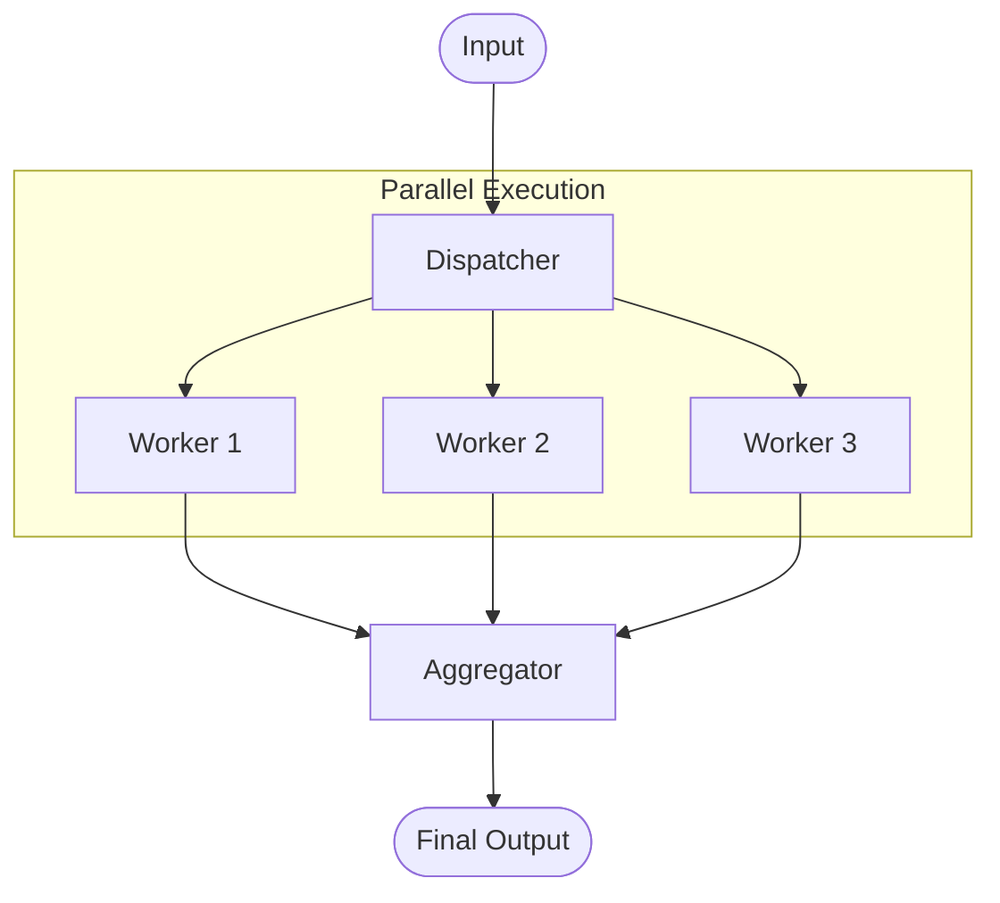

### When to Use
- Subtasks are **independent** — can run without waiting for each other
- Need **multiple perspectives** or higher confidence (voting)
- Complex tasks where each aspect benefits from **focused attention**

### Real-world Examples (Sectioning)
- Guardrails: one LLM answers, another screens for safety — in parallel
- Evaluating LLM outputs across multiple dimensions simultaneously

### Real-world Examples (Voting)
- Code vulnerability review: multiple prompts flag issues independently
- Content moderation: multiple reviewers vote with different thresholds

### Practical Example — Parallel Document Analysis

```python
import asyncio
from anthropic import AsyncAnthropic

client = AsyncAnthropic()


async def analyse_aspect(document: str, aspect: str) -> dict:
    """Analyse one specific aspect of a document."""
    response = await client.messages.create(
        model="claude-haiku-4-5",
        max_tokens=256,
        system=f"Analyse only the {aspect} of the provided document. Be concise.",
        messages=[{"role": "user", "content": document}],
    )
    return {"aspect": aspect, "analysis": response.content[0].text}


async def parallel_document_review(document: str) -> dict:
    """Run all analyses in parallel."""
    aspects = [
        "tone and style",
        "factual accuracy",
        "logical structure",
        "readability",
        "key risks",
    ]

    # Fire all requests simultaneously
    tasks = [analyse_aspect(document, aspect) for aspect in aspects]
    results = await asyncio.gather(*tasks)

    return {r["aspect"]: r["analysis"] for r in results}


# Voting example
async def vote_on_content(content: str, question: str, n_votes: int = 3) -> str:
    """Run same evaluation multiple times and take majority vote."""

    async def single_vote(_):
        r = await client.messages.create(
            model="claude-haiku-4-5",
            max_tokens=5,
            system="Answer with only YES or NO.",
            messages=[
                {"role": "user", "content": f"{question}\n\nContent:\n{content}"}
            ],
        )
        return "YES" in r.content[0].text.upper()

    votes = await asyncio.gather(*[single_vote(i) for i in range(n_votes)])
    yes_votes = sum(votes)
    return "APPROVED" if yes_votes > n_votes / 2 else "REJECTED"


# Usage
async def main():
    doc = "AI is transforming industries at an unprecedented pace..."

    print("=== Parallel Analysis ===")
    analysis = await parallel_document_review(doc)
    for aspect, result in analysis.items():
        print(f"\n{aspect.upper()}:\n{result}")

    print("\n=== Voting ===")
    verdict = await vote_on_content(
        doc, "Is this content suitable for a professional audience?"
    )
    print(f"Verdict: {verdict}")


asyncio.run(main())
```

---

## 8. Workflow: Orchestrator-Workers

A **central orchestrator LLM** dynamically breaks down a task, delegates subtasks to worker LLMs, and synthesises results. Unlike parallelisation, subtasks are **not predefined** — the orchestrator decides them based on the input.

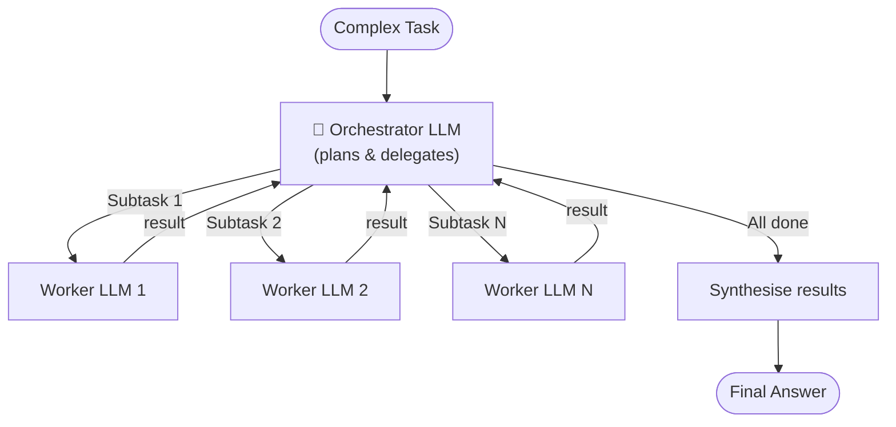

### When to Use
- Cannot predict the **number or nature of subtasks** upfront
- Tasks that vary significantly based on input (e.g. "edit all affected files")
- Research tasks requiring flexible multi-source gathering

### Real-world Examples
- Coding: identify which files to change, then change each independently
- Research: determine what to search for, gather from multiple sources, synthesise

### Practical Example — Research Orchestrator

```python
import json
from anthropic import Anthropic

client = Anthropic()


def worker_research(subtopic: str) -> str:
    """Worker: research a specific subtopic."""
    r = client.messages.create(
        model="claude-haiku-4-5",
        max_tokens=512,
        system="You are a research assistant. Provide factual, concise information.",
        messages=[{"role": "user", "content": f"Research and summarise: {subtopic}"}],
    )
    return r.content[0].text


def orchestrator_research(main_topic: str) -> str:
    # Step 1: Orchestrator plans the research
    plan_response = client.messages.create(
        model="claude-sonnet-4-5",
        max_tokens=512,
        system="You are a research orchestrator. Break down research topics into subtopics.",
        messages=[
            {
                "role": "user",
                "content": f"Break down this research topic into 3-4 specific subtopics to investigate:\n\nTopic: {main_topic}\n\nRespond with a JSON array of subtopic strings only.",
            }
        ],
    )

    subtopics = json.loads(plan_response.content[0].text)
    print(f"📋 Orchestrator planned {len(subtopics)} subtopics: {subtopics}")

    # Step 2: Dispatch workers
    worker_results = {}
    for subtopic in subtopics:
        print(f"  🔨 Worker researching: {subtopic}")
        worker_results[subtopic] = worker_research(subtopic)

    # Step 3: Orchestrator synthesises
    results_text = "\n\n".join(f"## {k}\n{v}" for k, v in worker_results.items())
    synthesis = client.messages.create(
        model="claude-sonnet-4-5",
        max_tokens=1024,
        system="You are an expert analyst. Synthesise research findings into a coherent summary.",
        messages=[
            {
                "role": "user",
                "content": f"Synthesise these research findings on '{main_topic}':\n\n{results_text}",
            }
        ],
    )

    return synthesis.content[0].text


result = orchestrator_research(
    "The impact of large language models on software development"
)
print("\n=== FINAL SYNTHESIS ===")
print(result)
```

---

## 9. Workflow: Evaluator-Optimizer

One LLM **generates** a response; another **evaluates and provides feedback** in a loop until quality criteria are met.

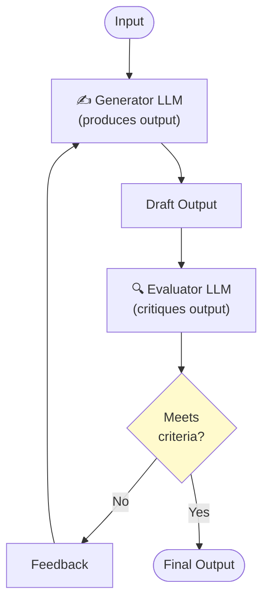

### When to Use
- Clear **evaluation criteria** exist
- Iterative refinement provides **measurable improvement**
- LLM responses demonstrably improve when given structured feedback

### Real-world Examples
- Literary translation: translator → evaluator critiques nuance → retranslate
- Complex search: search → evaluator decides if more searching needed → repeat

### Practical Example — Code Review Loop

```python
from anthropic import Anthropic

client = Anthropic()


def generator(task: str, previous_feedback: str = "") -> str:
    system = "You are an expert Python developer. Write clean, efficient, well-documented code."
    prompt = task
    if previous_feedback:
        prompt += f"\n\nPrevious feedback to address:\n{previous_feedback}"

    r = client.messages.create(
        model="claude-sonnet-4-5",
        max_tokens=1024,
        system=system,
        messages=[{"role": "user", "content": prompt}],
    )
    return r.content[0].text


def evaluator(code: str, criteria: list[str]) -> dict:
    criteria_text = "\n".join(f"- {c}" for c in criteria)
    r = client.messages.create(
        model="claude-sonnet-4-5",
        max_tokens=512,
        system="You are a strict code reviewer. Evaluate code against specific criteria.",
        messages=[
            {
                "role": "user",
                "content": f'Evaluate this code against these criteria:\n{criteria_text}\n\nCode:\n{code}\n\nRespond with JSON: {{"passes": true/false, "feedback": "...", "score": 1-10}}',
            }
        ],
    )
    import json

    return json.loads(r.content[0].text)


def evaluator_optimizer_loop(
    task: str, criteria: list[str], max_iterations: int = 3
) -> str:
    feedback = ""
    for i in range(max_iterations):
        print(f"\n🔄 Iteration {i + 1}/{max_iterations}")

        # Generate
        output = generator(task, feedback)
        print(f"✍️  Generated ({len(output)} chars)")

        # Evaluate
        evaluation = evaluator(output, criteria)
        print(f"🔍 Score: {evaluation['score']}/10 | Passes: {evaluation['passes']}")

        if evaluation["passes"]:
            print("✅ Passed all criteria!")
            return output

        feedback = evaluation["feedback"]
        print(f"💬 Feedback: {feedback[:100]}...")

    print("⚠️  Max iterations reached, returning best attempt")
    return output


result = evaluator_optimizer_loop(
    task="Write a Python function that efficiently finds all prime numbers up to n using the Sieve of Eratosthenes.",
    criteria=[
        "Uses the Sieve of Eratosthenes algorithm correctly",
        "Includes type hints",
        "Has a docstring with examples",
        "Handles edge cases (n <= 1)",
        "Time complexity is O(n log log n)",
    ],
)
print("\n=== FINAL CODE ===")
print(result)
```

---

## 10. Autonomous Agents

Agents use tools in a **loop driven by environmental feedback**. Unlike workflows, they operate with open-ended autonomy — the number of steps is not known upfront.

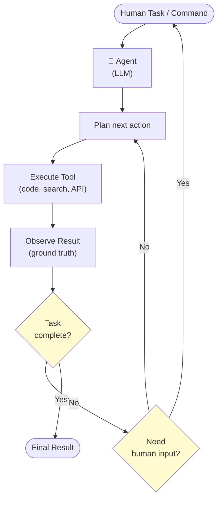

### When to Use
- **Open-ended problems** — impossible to predict the number of steps
- No fixed path can be hardcoded
- Tasks in **trusted environments** where autonomy is acceptable

### Real-world Examples (Anthropic's own implementations)
- **SWE-bench coding agent** — edits multiple files based on a GitHub issue description
- **Computer use** — Claude controls a computer interface to accomplish tasks

### Key Safety Considerations

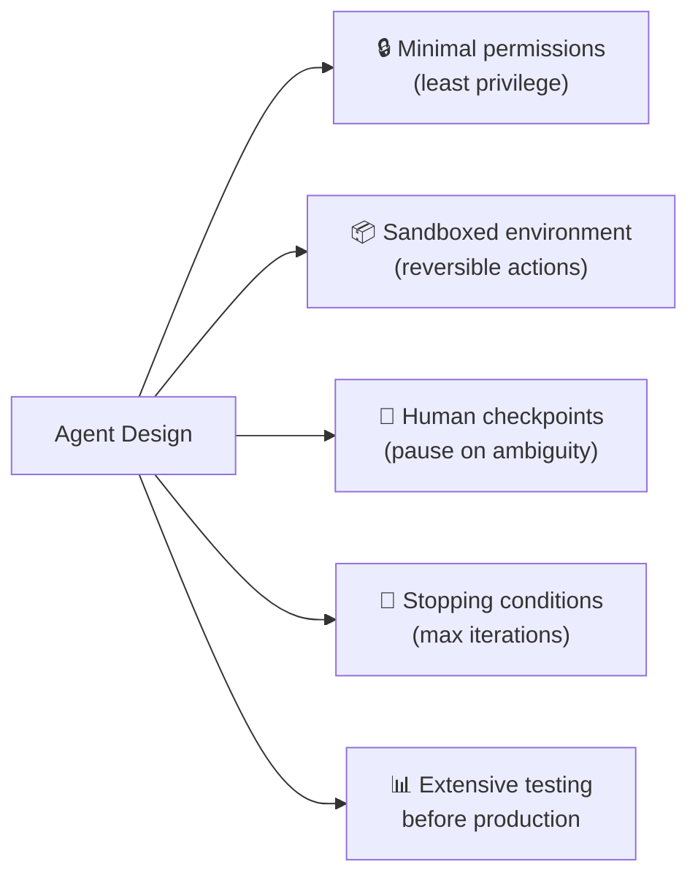

### Practical Example — File System Agent

```python
import os
import json
from anthropic import Anthropic

client = Anthropic()

# Tools available to the agent
tools = [
    {
        "name": "read_file",
        "description": "Read the contents of a file at the given absolute path.",
        "input_schema": {
            "type": "object",
            "properties": {
                "path": {"type": "string", "description": "Absolute file path"}
            },
            "required": ["path"],
        },
    },
    {
        "name": "list_directory",
        "description": "List all files and folders in a directory.",
        "input_schema": {
            "type": "object",
            "properties": {
                "path": {"type": "string", "description": "Absolute directory path"}
            },
            "required": ["path"],
        },
    },
    {
        "name": "write_file",
        "description": "Write content to a file. Creates the file if it does not exist.",
        "input_schema": {
            "type": "object",
            "properties": {
                "path": {"type": "string"},
                "content": {"type": "string"},
            },
            "required": ["path", "content"],
        },
    },
]


def execute_tool(name: str, inputs: dict) -> str:
    """Execute a tool call and return the result as a string."""
    try:
        if name == "read_file":
            with open(inputs["path"]) as f:
                return f.read()
        elif name == "list_directory":
            entries = os.listdir(inputs["path"])
            return json.dumps(entries)
        elif name == "write_file":
            with open(inputs["path"], "w") as f:
                f.write(inputs["content"])
            return f"File written: {inputs['path']}"
        else:
            return f"Unknown tool: {name}"
    except Exception as e:
        return f"Error: {e}"


def run_agent(task: str, max_iterations: int = 10) -> str:
    messages = [{"role": "user", "content": task}]
    iteration = 0

    while iteration < max_iterations:
        iteration += 1
        print(f"\n🔄 Agent iteration {iteration}")

        response = client.messages.create(
            model="claude-sonnet-4-5",
            max_tokens=2048,
            system="You are a helpful file system agent. Use tools to accomplish tasks. Always use absolute paths.",
            tools=tools,
            messages=messages,
        )

        if response.stop_reason == "end_turn":
            final = next(
                (b.text for b in response.content if hasattr(b, "text")), "Done."
            )
            print(f"✅ Agent completed: {final}")
            return final

        # Process tool calls
        tool_results = []
        for block in response.content:
            if block.type == "tool_use":
                print(f"  🔧 Tool: {block.name}({block.input})")
                result = execute_tool(block.name, block.input)
                print(f"  📤 Result: {result[:80]}...")
                tool_results.append(
                    {
                        "type": "tool_result",
                        "tool_use_id": block.id,
                        "content": result,
                    }
                )

        messages.append({"role": "assistant", "content": response.content})
        messages.append({"role": "user", "content": tool_results})

    return "Max iterations reached."


# Usage
run_agent(f"List the files in {os.path.abspath('.')} and summarise what you find.")
```

---

## 11. Combining Patterns

These patterns are building blocks — combine them freely to match your use case.

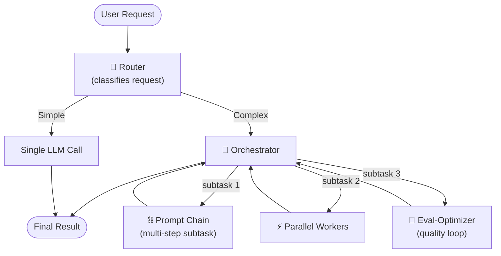

### Example: Combined Pattern for Document Processing

```
1. Router → categorise document type
2. If legal doc → Prompt Chain (extract → summarise → translate)
3. If technical doc → Parallel (analyse security, performance, readability simultaneously)
4. Final output → Evaluator-Optimizer (refine until quality bar met)
```

---

## 12. Summary & Core Principles

> **The goal is not the most sophisticated system. It is the right system for your needs.**

### Decision Framework

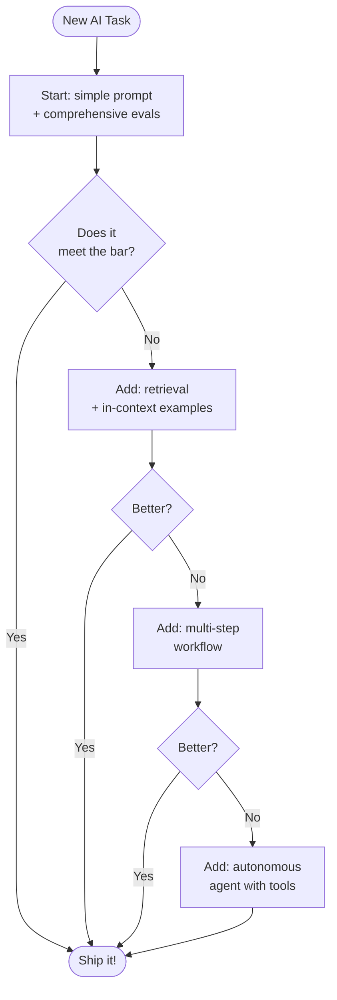

### Three Core Principles

| # | Principle | What it means |
|---|-----------|--------------|
| 1 | **Maintain simplicity** | Don't add agent complexity unless simpler options fail |
| 2 | **Prioritise transparency** | Show the agent's planning steps explicitly |
| 3 | **Craft your ACI carefully** | Treat tool documentation as seriously as prompt engineering |

---

## Appendix A: Agents in Practice

### A. Customer Support

**Why it's a natural fit:**

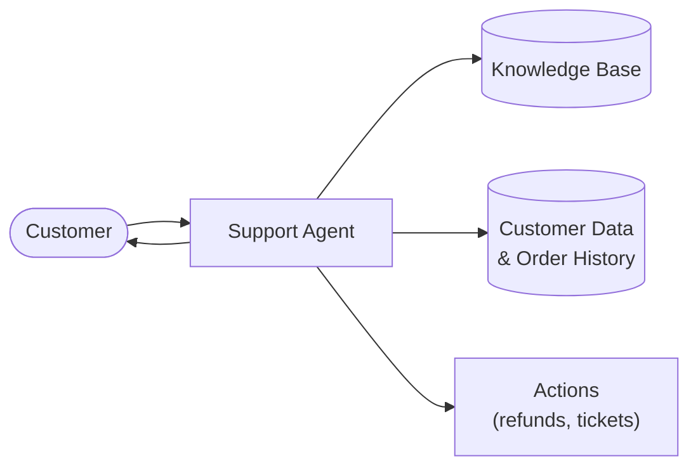

| Factor | Detail |
|--------|--------|
| Interface | Conversational — fits naturally |
| Tools | Customer data, order history, knowledge base |
| Actions | Issue refunds, update tickets — programmable |
| Success metric | Clear: resolved vs. unresolved |
| Business model | Usage-based pricing per successful resolution |

---

### B. Coding Agents

**Why code is an ideal domain for agents:**

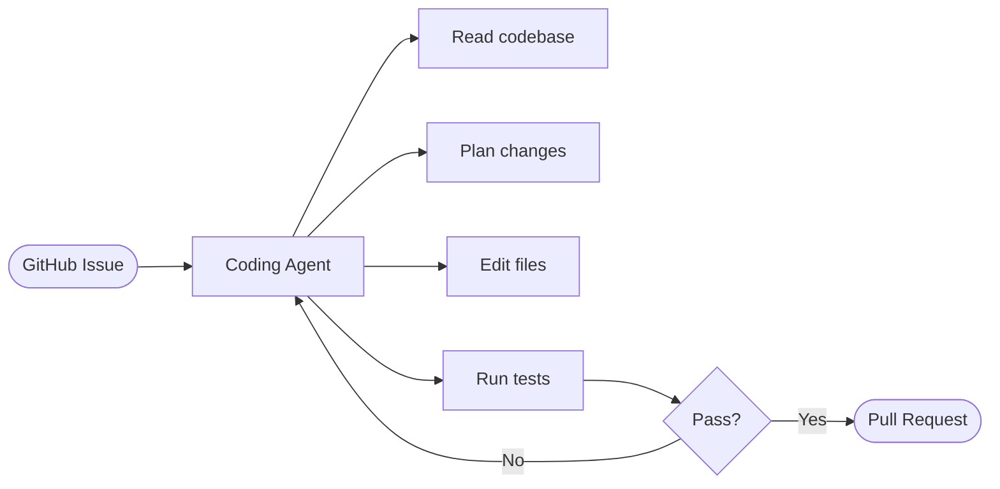

| Factor | Detail |
|--------|--------|
| Verifiability | Automated tests provide ground truth |
| Feedback loop | Test results guide the next iteration |
| Problem space | Well-defined, structured |
| Quality measurement | Objective (tests pass/fail) |
| Human role | Review PRs for broader system alignment |

---

## Appendix B: Prompt Engineering Your Tools

### Core Principle

> Invest as much effort in your **Agent-Computer Interface (ACI)** as you would in a Human-Computer Interface (HCI).

### Tool Format Guidelines

| Guideline | Why it matters |
|-----------|---------------|
| Give the model enough tokens to think before writing | Prevents painting the model into a corner |
| Use formats close to natural internet text | Matches training distribution |
| Avoid format overhead (line counts, string escaping) | Reduces unnecessary errors |

### Tool Definition Best Practices

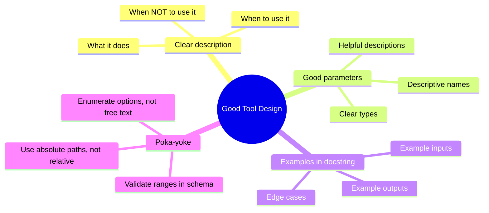

### Practical Example — Well-Engineered Tool Definition

```python
# ❌ Bad tool definition
bad_tool = {
    "name": "edit",
    "description": "Edit a file.",
    "input_schema": {
        "type": "object",
        "properties": {
            "f": {"type": "string"},
            "t": {"type": "string"},
        },
    },
}

# ✅ Good tool definition
good_tool = {
    "name": "edit_file",
    "description": (
        "Replace a specific string in a file with new content. "
        "Use this to make targeted edits to existing files. "
        "Always use absolute file paths (never relative). "
        "The old_string must match exactly — including whitespace and indentation. "
        "Do NOT use this to create new files; use create_file instead.\n\n"
        "Example:\n"
        "  path: /home/user/project/main.py\n"
        "  old_string: 'def hello():\\n    print(\"hi\")'\n"
        "  new_string: 'def hello(name: str):\\n    print(f\"hi {name}\")'"
    ),
    "input_schema": {
        "type": "object",
        "properties": {
            "path": {
                "type": "string",
                "description": "Absolute path to the file to edit (e.g. /home/user/project/main.py). Never use relative paths.",
            },
            "old_string": {
                "type": "string",
                "description": "The exact string to find and replace. Must match the file content exactly, including indentation.",
            },
            "new_string": {
                "type": "string",
                "description": "The replacement string. Leave empty to delete old_string.",
            },
        },
        "required": ["path", "old_string", "new_string"],
    },
}
```

### Testing Your Tools

```python
import anthropic

client = anthropic.Anthropic()


def test_tool_usage(tool: dict, test_prompts: list[str]) -> None:
    """
    Run test prompts to see how the model uses your tool.
    Reveals misuse patterns before production.
    """
    for prompt in test_prompts:
        print(f"\nPrompt: {prompt}")
        response = client.messages.create(
            model="claude-haiku-4-5",
            max_tokens=512,
            tools=[tool],
            messages=[{"role": "user", "content": prompt}],
        )
        for block in response.content:
            if hasattr(block, "type") and block.type == "tool_use":
                print(f"Tool called: {block.name}")
                print(f"Inputs: {block.input}")


# Test with varied inputs to spot edge cases
test_tool_usage(
    good_tool,
    [
        "Change the print statement in main.py to also print the date",
        "Update the function signature to accept a name parameter",
        "Remove the debug print statement from line 42",
    ],
)
```

---

## Quick Reference Card

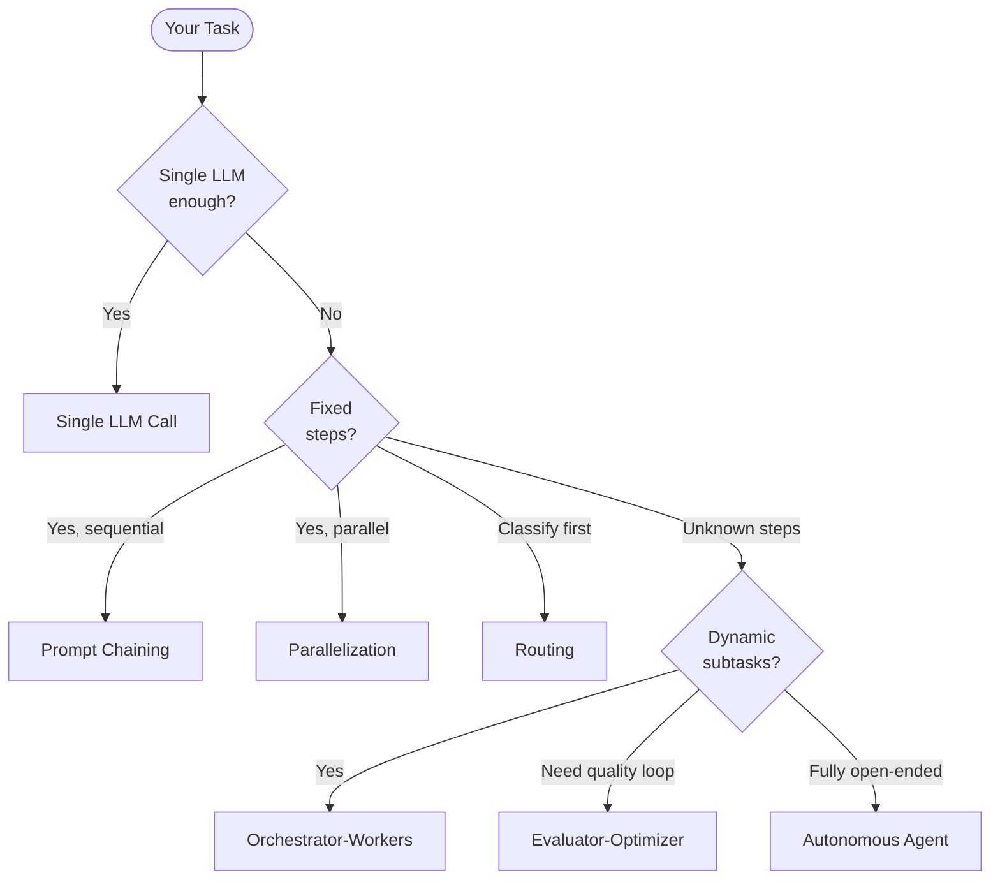

| Pattern | Latency | Cost | Use when |
|---------|---------|------|----------|
| Single LLM | ⚡ | 💚 | Simple tasks, Q&A |
| Prompt Chaining | 🟡 | 🟡 | Fixed sequential steps |
| Routing | ⚡ | 💚 | Different input types |
| Parallelization | ⚡ | 🟡 | Independent subtasks |
| Orchestrator-Workers | 🔴 | 🔴 | Dynamic subtasks |
| Evaluator-Optimizer | 🔴 | 🔴 | Quality-critical output |
| Autonomous Agent | 🔴 | 🔴 | Open-ended problems |

---

*Source: [Anthropic Engineering — Building effective agents](https://www.anthropic.com/engineering/building-effective-agents)*
