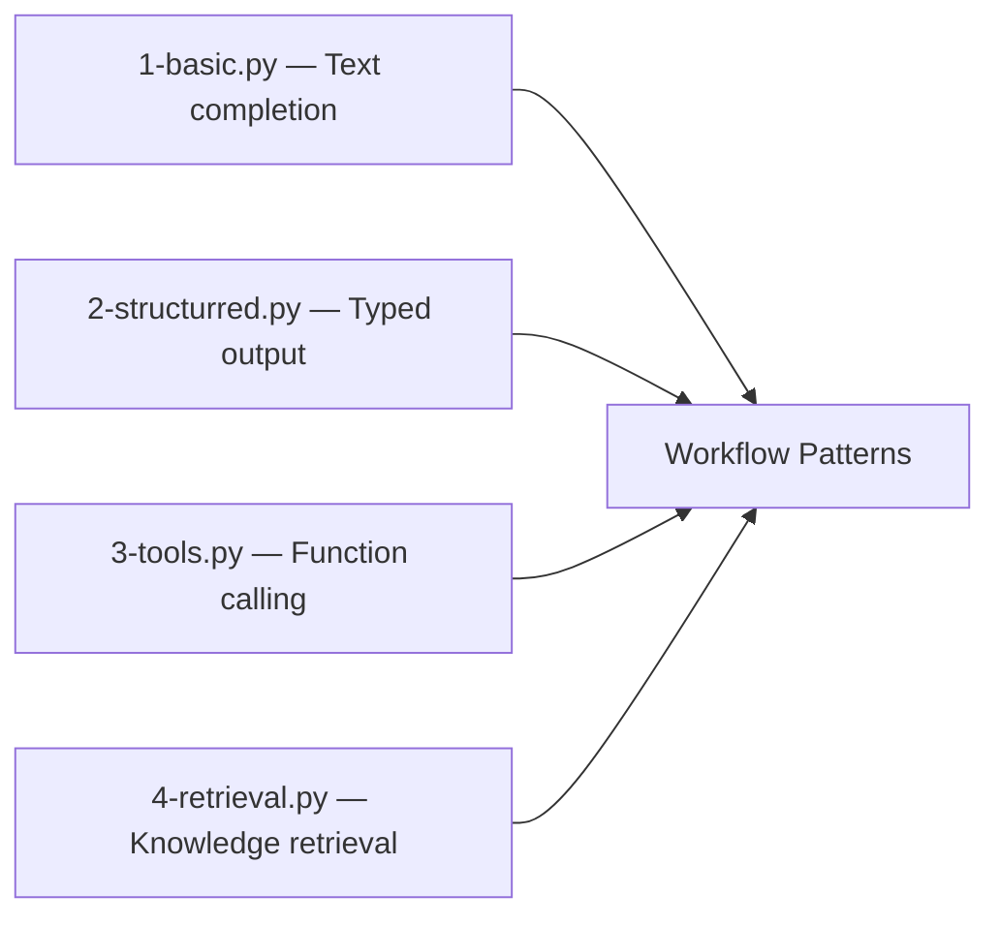
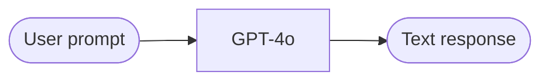
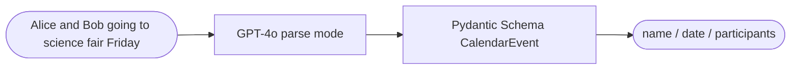
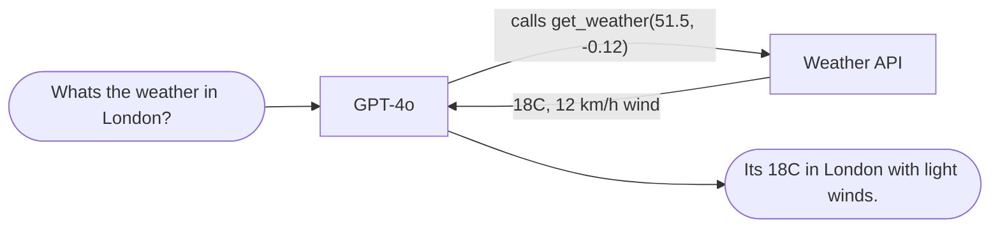
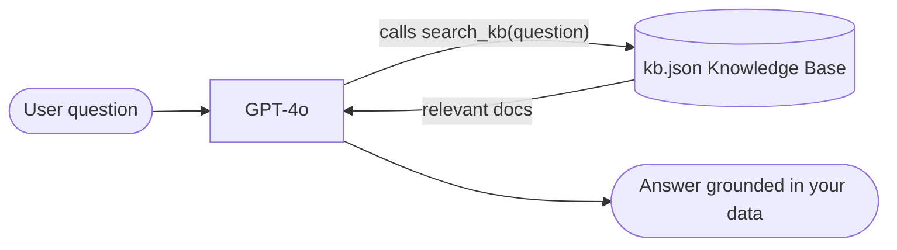
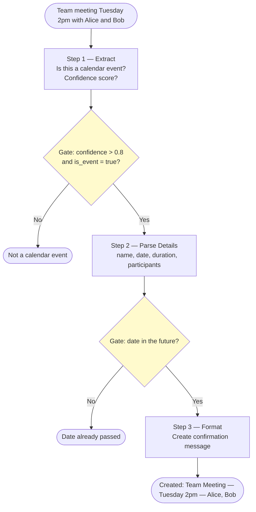
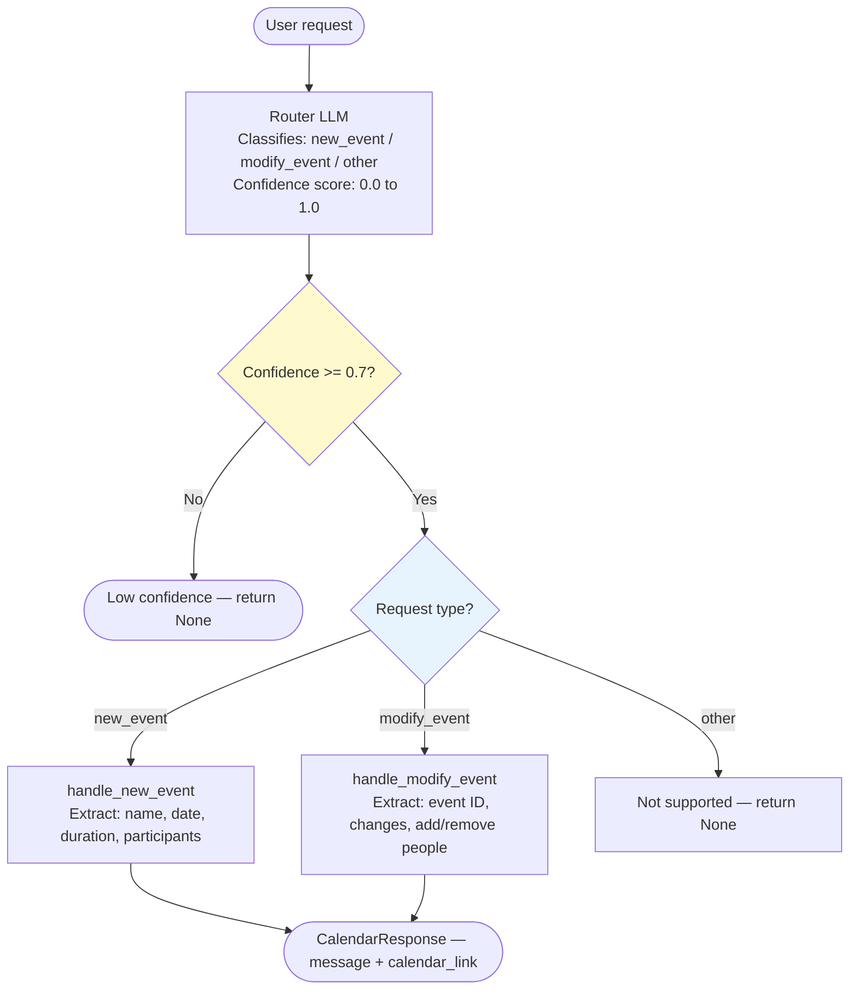
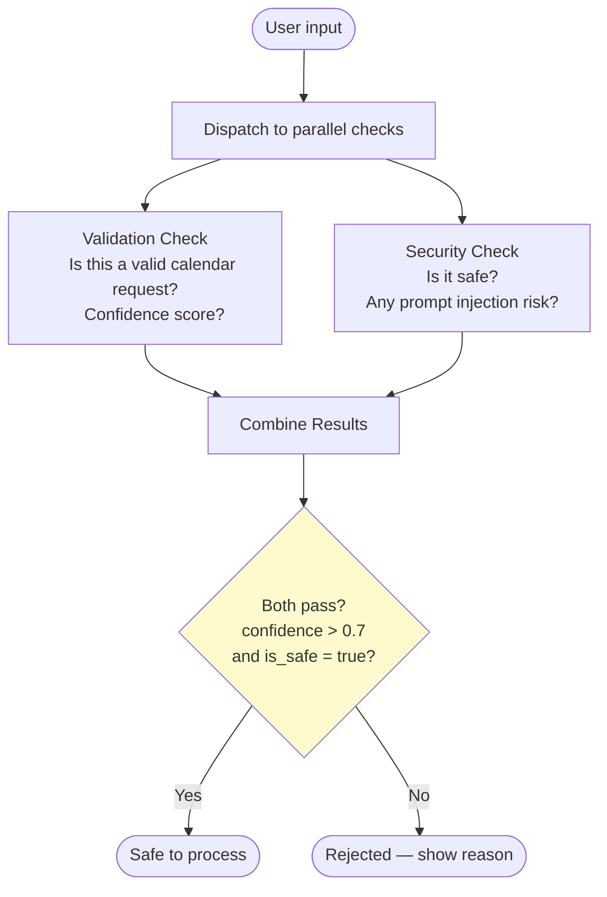
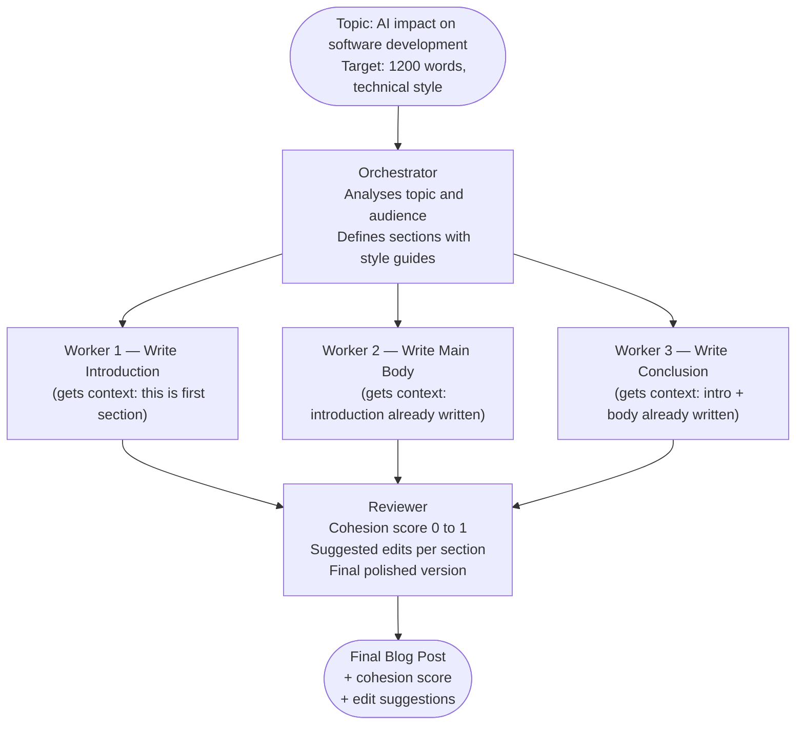
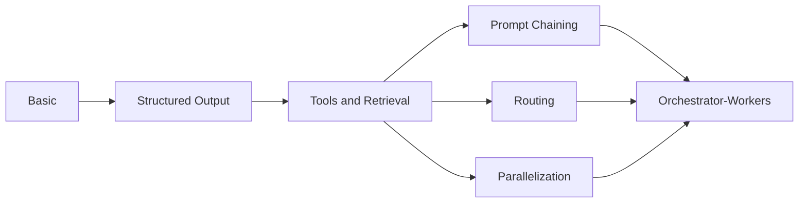

# LLM Workflow Patterns

A practical guide to building LLM-powered workflows — from a single API call to multi-agent orchestration. All examples use the OpenAI API with Pydantic for structured output.

---

## Folder Structure

```
patterns/workflows/
├── 1-introduction/          # Core LLM capabilities (the building blocks)
│   ├── 1-basic.py           # Plain text completion
│   ├── 2-structurred.py     # Structured / typed output
│   ├── 3-tools.py           # Function / tool calling
│   └── 4-retrieval.py       # Knowledge base retrieval
│
└── 2-workflow-patterns/     # Combining building blocks into patterns
    ├── 1-prompt-chaining.py # Sequential steps with gate checks
    ├── 2-routing.py         # Route input to the right handler
    ├── 3-parallization.py   # Run checks in parallel
    └── 4-orchestrator.py    # Orchestrator + workers pattern
```

---

## Part 1 — Introduction: Core Building Blocks

These four files each demonstrate one fundamental LLM capability. Every workflow pattern builds on top of these.



---

### 1. Basic — `1-basic.py`

The simplest possible LLM call. Send a prompt, get text back.



**What it does:** Calls `client.chat.completions.create()` with a system and user message.
**Use when:** You just need a natural language answer — no structure needed.

---

### 2. Structured Output — `2-structurred.py`

Forces the LLM to return typed, validated data using a Pydantic schema instead of free text.



**What it does:** Uses `client.beta.chat.completions.parse()` + a `BaseModel` to guarantee the output shape.
**Use when:** Downstream code needs to read specific fields from the response.

---

### 3. Tools (Function Calling) — `3-tools.py`

Lets the LLM call your Python functions to get real-world data.



**What it does:** Defines a tool schema → LLM decides to call it → your code executes it → result goes back to LLM.
**Use when:** The LLM needs live or external data it does not have in training.

---

### 4. Retrieval — `4-retrieval.py`

Gives the LLM access to a private knowledge base via a search tool.



**What it does:** Loads relevant documents from a JSON knowledge base and passes them to the LLM as context.
**Use when:** The LLM needs to answer questions about your own private data (RAG pattern).

---

## Part 2 — Workflow Patterns

These patterns combine the building blocks above into more powerful, reliable systems.

---

### 1. Prompt Chaining — `1-prompt-chaining.py`

Break a complex task into a **fixed sequence of LLM calls**, where each step's output feeds the next. Gate checks validate output before moving forward.

**Use case:** Processing a calendar request — extract → validate → format → confirm.



**Why use it:**
- Each step does one thing — easier to debug
- Gates stop bad input early, saving compute on later steps
- Focused LLM calls → higher accuracy per step

---

### 2. Routing — `2-routing.py`

**Classify the input first**, then send it to the right specialised handler.

**Use case:** A calendar assistant that handles creating new events and modifying existing ones via different prompts.



**Why use it:**
- Each handler has a focused prompt — no single prompt handling everything
- Cheap router model (GPT-4o-mini) → expensive model only for actual work
- Confidence threshold filters out ambiguous or off-topic input

---

### 3. Parallelization — `3-parallization.py`

Run **multiple LLM checks simultaneously** and combine the results. Same latency as running one check.

**Use case:** Validate a calendar request for content validity AND security at the same time.



**Why use it:**
- Both checks run at the same time — half the latency vs sequential
- Each LLM focuses on one concern → better accuracy than one big prompt
- Easy to add more parallel checks without increasing total latency

---

### 4. Orchestrator-Workers — `4-orchestrator.py`

A **central orchestrator LLM** plans the work, **worker LLMs** each write one section with context from previous sections, and a **reviewer LLM** polishes the final result.

**Use case:** Writing a full blog post — orchestrator decides structure, workers write each section, reviewer improves cohesion.



**Data models used:**

| Model | Purpose |
|-------|---------|
| `SubTask` | One section: type, description, style guide, target word count |
| `OrchestratorPlan` | Topic analysis + audience + list of SubTasks |
| `SectionContent` | Written content + key points for one section |
| `ReviewFeedback` | Cohesion score + suggested edits + final polished post |

**Why use it:**
- Orchestrator dynamically decides the sections — no hardcoded structure
- Each worker receives context from previously written sections for coherence
- Reviewer ensures the whole post flows better than its individual parts

---

## Pattern Comparison

| Pattern | When to use | Latency | Complexity |
|---------|-------------|---------|------------|
| Basic | Simple Q&A, no structure needed | Lowest | Low |
| Structured Output | Need typed fields for code to use | Low | Low |
| Tools | Need live or external data | Medium | Medium |
| Retrieval | Answer from your own private data | Medium | Medium |
| Prompt Chaining | Fixed multi-step task with quality gates | Medium | Medium |
| Routing | Different input types need different handlers | Low | Medium |
| Parallelization | Independent checks that can run together | Low | Medium |
| Orchestrator-Workers | Dynamic tasks, number of steps not known upfront | High | High |

---

## How patterns build on each other



> **Rule of thumb:** Start with the simplest pattern. Only add complexity when you can measure that it improves results.

---

## Setup

```bash
# Set your OpenAI API key
export OPENAI_API_KEY=sk-...

# Run any example from the repo root
python patterns/workflows/1-introduction/1-basic.py
python patterns/workflows/2-workflow-patterns/4-orchestrator.py
```

**Dependencies:** `openai`, `pydantic`, `requests`, `nest_asyncio`
